# Rotari: File-based, flexible job runner for local and batch workloads

[](https://github.com/kamo-naoyuki/rotari/actions/workflows/ci.yml) [](https://github.com/kamo-naoyuki/rotari/actions/workflows/scheduler-integration.yml) [](https://kamo-naoyuki.github.io/rotari/)

Rotari turns trial-and-error into a repeatable loop: run a batch of jobs, see which failed, fix only their commands, and run it again — without losing the history of what already worked.

Local commands and scheduler jobs (Slurm, PBS, LSF) live in the same queue, even when they depend on each other. Every run keeps its own snapshot of commands, status, and logs, so nothing gets lost between "one more try" and the next.

No DAGs to design, no pipeline to describe up front like
[Snakemake](https://github.com/snakemake/snakemake) or
[Nextflow](https://github.com/nextflow-io/nextflow) — powerful tools for
complex, data-dependent pipelines, but more than most ad-hoc experiment
loops need. Just queue what you want to run. State lives in plain JSON
files on disk, with no server or database to set up — it works the same
whether you're on your laptop or logged into a remote compute node.

| Plain shell (background jobs) | rotari |
| --- | --- |
|  |  |

If you've used [Kaldi](https://github.com/kaldi-asr/kaldi)'s or
[ESPnet](https://github.com/espnet/espnet)'s `run.pl`/`queue.pl` — the
local/cluster job dispatch scripts common in speech recognition research —
to switch between local and cluster job submission, rotari extends that
idea with per-run history, dependency handling, and rerunning only what
failed.

## Installation

### Prebuilt binary

Download the latest binary for your platform, make it executable, and put it
somewhere on your `PATH`:

```sh
os=$(uname -s | tr '[:upper:]' '[:lower:]')
arch=$(uname -m | sed 's/x86_64/amd64/; s/aarch64/arm64/')
curl -fL "https://github.com/kamo-naoyuki/rotari/releases/latest/download/rotari-${os}-${arch}" \
  -o /tmp/rotari
install -m 755 /tmp/rotari ~/.local/bin/rotari
```

Prebuilt binaries for Linux and macOS are available from the GitHub Releases
page. Go is not required when using a prebuilt binary.

The latest release is also
available from the [GitHub Releases](https://github.com/kamo-naoyuki/rotari/releases)
page.

Check the version:

```sh
rotari version
rotari --version
```

### Build from source

If you have Go installed, you can build rotari from source:

```sh
go build -o rotari ./cmd/rotari
install -m 755 ./rotari ~/.local/bin/rotari
```

Alternatively, install the latest version directly with `go install`:

```sh
go install github.com/kamo-naoyuki/rotari/cmd/rotari@latest
```

## Shell completion

Completion scripts are available for Bash and Zsh:

```sh
# Install for the default shell reported by $SHELL
rotari completion install

# Select the shell explicitly when running a nested shell
rotari completion install bash
rotari completion install zsh
```

The completion is generated from the CLI metadata used by the program, and
covers subcommands, command options, executor values, run selection values, and
the `server` subcommands. `completion install` updates the shell configuration
idempotently; it does not duplicate an existing rotari completion block. Start a
new shell after installation, or source the shell configuration to apply it to
the current shell.

For manual setup, `rotari completion bash` and `rotari completion zsh` print the
raw completion scripts.

Frequently used options have short forms:

| Long option | Short option |
| --- | --- |
| `--project-name` | `-p` |
| `--basedir` | `-b` |
| `--run-id` | `-r` |
| `--job-id` | `-j` |
| `--executor` | `-e` |

## Quick start

```sh
# Queue multiple commands, then run them together.
rotari check --project-name build
rotari add --project-name build --job-name build make
rotari add --project-name build --name unit-tests go test ./...
rotari run --project-name build --run-name unit-build

# Or add and run a single command immediately.
rotari add --run --project-name build go test ./...
```

`add` adds a command. `run` executes the queued commands and waits for
completion. A project contains its current queue and saved runs. The project
name can be supplied with `--project-name`, `ROTARI_PROJECT_NAME`, or omitted.
When omitted, if only one project exists in the state directory, it is selected
automatically; if multiple projects exist, you will be prompted to specify one.
Use `--job-name NAME` (or its `--name NAME` alias) to label a submitted job.
Use `--run-name NAME` to label a run; the generated run ID remains available for
unambiguous paths and commands.
Use `add --run` to add a command and immediately execute the queue in one command.

Use `--depends-on NAME` to make a job wait for a named prerequisite. Repeat the
option to specify multiple prerequisites:

```sh
rotari add --job-name prepare ./prepare.sh
rotari add --job-name train --depends-on prepare ./train.sh
rotari run
```

Jobs without dependencies run in parallel. Dependencies must refer to named
jobs in the same queue; unknown jobs and dependency cycles are rejected before
the run starts. If a prerequisite fails, dependent jobs are recorded as
`blocked` and are not executed. Retries rerun only failed jobs, not jobs that
already succeeded. `rotari retry` likewise reruns failed and
unfinished job bodies
without rerunning successful prerequisites.

The typical debug loop is deliberately short:

```sh
rotari show --project-name build --failed-logs
rotari change --project-name build --job-name train -- ./train-v2.sh
rotari retry --project-name build
```

Jobs that already succeeded are not re-executed; they are carried forward into
the new run with their previous result and a link back to the original output,
so the whole run (old successes and freshly retried jobs) shows up together on
one run page. This makes it practical to keep debugging until the experiment
is complete without rerunning work that already succeeded.

Copy jobs from a previous run into the current queue without executing them:

```sh
rotari copy --project-name build --run-id RUN_ID --failed --unfinished
rotari change --project-name build --job-name unit-tests -- go test ./...
rotari run --project-name build --retry 2
```

`copy` creates new job IDs only if they would collide with jobs already in the
destination queue; otherwise the source job ID is kept, and dependencies
between copied jobs are preserved. If the queue is non-empty, the CLI asks for
confirmation before replacing it; use `--append` to add copied jobs or
`--overwrite` to replace it without asking. Selection options include
`--failed`, `--unfinished`, `--success`, and repeated `--job-id`.
Copied jobs remain pending in the new queue. Their source run, source job,
source status, and original working directory are retained as metadata so the
original output can be inspected without copying it.

`run` (and its aliases `retry` and, with explicit filters, `run --failed`
etc.) can also select jobs directly from a run instead of the live queue.
`--run-id ID` repopulates the queue from that run first, equivalent to
`copy --run-id ID --overwrite` followed by `run`; result filters
(`--failed`/`--unfinished`/`--success`/`--job-id`) then decide which of those
jobs are actually re-executed. If the current queue is non-empty, confirmation
is required before replacement; add `--overwrite` to `run --run-id` or
`retry --run-id` to replace it without asking. Jobs that don't match the filter
but already finished in the reference run (the given `--run-id`, or the latest
run when `--run-id` is omitted) are carried forward instead of re-executed. For
example:

```sh
rotari run --project-name build --run-id RUN_ID --failed
```

is equivalent to:

```sh
rotari copy --project-name build --run-id RUN_ID --overwrite
rotari run --project-name build --failed
```

## Local web UI

See the [web demo](https://kamo-naoyuki.github.io/rotari/) for a read-only UI
using generated example data.

Start the local web status UI separately from the job runner:

```sh
rotari web
```

Open `http://127.0.0.1:8787` in a browser. By default, the web server shows all
projects in the state directory; use `--project-name build` to filter to one project.
The CLI reference generated from the same command metadata used by help and
shell completion is available at `http://127.0.0.1:8787/docs/`.
It reads job state from the state directory and shows the working directory
and terminal command needed to copy jobs for another run. While a run is
active, scheduler jobs show their latest Slurm, PBS, or LSF state, such as
`pending`, `running`, or `suspended`. It can also copy all or failed jobs into
a queue after confirmation; it does not start or control the runner.
Stopping the web server does not stop the runner or any jobs.

## Example

Build and run the included example:

```sh
go build -o rotari ./cmd/rotari
./example.sh demo
```

The example includes local and Slurm jobs in one queue. Set
`ROTARI_ASYNC=true` to use async mode.

## Projects, queues, runs, and state

A project groups one current queue and its run history. `add` assembles the
next experiment in `queue.json`. `run` freezes that batch into one run ID and
stores its snapshot, logs, and results separately.


The state directory mirrors this lifecycle:

```text
<basedir>/
└── projects/
  └── <project-name>/
    ├── queue.json
    └── runs/
      └── <run-id>/
        ├── commands.json
        ├── summary.json
        └── <job-id>/
          ├── command.json
          └── output
```

Each submitted command has a stable job ID. `run` saves the complete command
snapshot under `runs/<run-id>/`, together with a summary and each job's log.
After it finishes, the queue is emptied, while the run can be inspected or used
with selections such as `rotari retry`. The next `add` starts a new batch while
keeping the previous run history. Use `delete` to remove saved run logs
explicitly. Use `run --async` when an experiment should continue after the
terminal returns.

## Environment variables

| Variable | Purpose |
| --- | --- |
| `ROTARI_BASEDIR` | Base directory for project state. Overridden by `--basedir`. |
| `ROTARI_PROJECT_NAME` | Default project name. Overridden by `--project-name`. |
| `ROTARI_MASTERDIR` | Directory used by `rotari server list` to find supervisors. |
| `XDG_STATE_HOME` | Base location used when `ROTARI_BASEDIR` or `ROTARI_MASTERDIR` is not set. |

The resolution order for the state directory is:
1. `--basedir` option
2. `ROTARI_BASEDIR` environment variable
3. `./.rotari-state` (if it exists in the current directory)
4. Default location (`$XDG_STATE_HOME/rotari` or `~/.local/state/rotari`)

The resolution logic for the project name when `--project-name` is omitted is:
1. `--project-name` option
2. `ROTARI_PROJECT_NAME` environment variable
3. Automatically select if exactly one project exists in the state directory
4. Default project name (`default`) if no projects exist yet (if multiple projects exist, an error will prompt you to specify one)

The included `example.sh` also supports:

| Variable | Purpose |
| --- | --- |
| `ROTARI_SLURM_OPTIONS` | Common Slurm options used by the example, such as `-p short`. |
| `ROTARI_ASYNC` | Set to `true` to run the example asynchronously; defaults to `false`. |

## Scheduler

Executor and scheduler options can be set per command:

```sh
rotari add --project-name build make
rotari add --project-name build \
  --executor slurm \
  --executor-option="-p short --cpus-per-task=2" \
  ./heavy-test.sh
rotari run --project-name build --local-concurrency 4 --batch-concurrency 8 --retry 2
```

Local and scheduler-backed commands may be mixed in the same queue. Use
`--local-concurrency` for local jobs and `--batch-concurrency` for scheduler jobs.
`--batch-concurrency` only limits how many scheduler jobs rotari submits and
tracks concurrently. It does not change scheduler state, queue priority, or
the scheduler's own execution limits; after submission, the scheduler decides
whether each job is `pending`, `running`, or in another state.
Use `--retry N` to retry failed jobs up to N additional times.
Use `--retry -1` to retry failed jobs indefinitely.

The Slurm and PBS executors are smoke-tested in CI against containerized
scheduler installations. The LSF executor is covered by unit tests using fake
scheduler commands, but has not yet been tested against a real LSF installation.

## Async runs

```sh
rotari run --project-name build --async
rotari wait --project-name build
```

The async start message prints commands for checking status and cancelling the
run. `wait` returns the overall run exit code.

Pressing Ctrl-C during a synchronous `rotari run` requests cancellation. The
supervisor waits for the runner to finish its normal cleanup, including the
run summary, queue clearing, and run-lock removal; routine interruption does
not require `unlock` or `server shutdown`.

An async run is started as a detached process in a new session (`setsid`), so
it keeps running even if the terminal that launched it is closed. Use
`rotari wait` from any terminal (or later) to block on the run, and
`rotari cancel` to stop it.

## Inspect and recover

To inspect the latest run or list all runs:

```sh
rotari show --project-name build
rotari show --project-name build --runs
rotari show --project-name build --failed
rotari show --project-name build --job-id JOB_ID
rotari show --project-name build --logs
rotari show --project-name build --failed-logs
```

`--logs` prints the output log for every job in the selected run.
`--failed-logs` prints logs only for jobs that failed. Both options accept
`--run-id RUN_ID` to inspect a specific run.
Without `--run-id`, `show` displays the active run while a project is running,
then the current queue when it has commands, and otherwise the latest run. A
queued-jobs view includes the exact `rotari run` command needed to execute them.
Use `--run-id` to inspect a specific saved run.

If a runner exits before finalizing its run, `show` displays that interrupted
run and a recovery command instead of presenting the retained queue as new
work. `add`, `copy`, and `run` remain blocked until the interrupted state is
acknowledged. Run `rotari check` in a terminal to confirm that all jobs have
stopped, then choose whether to keep or discard the retained queue. Keeping it
shows the jobs as queued for the next run; some may already have results in the
interrupted run, so use `retry` or result filters when appropriate. Discarding
clears the queued jobs but preserves the interrupted run history. The exact
choice can be supplied without prompting as `rotari check --recover keep` or
`rotari check --recover discard`. The exact `rotari unlock` command displayed
by `show` is another non-interactive recovery path and keeps the queue.
When output is a terminal, log views (including `--job-id`) longer than 24
lines open in `$PAGER` (or `less -R` by default). Use `--no-pager` to print
directly; piped and redirected output is always printed directly.

Run selected jobs from the latest run, carrying forward everything else:

```sh
rotari run --project-name build --failed
rotari run --project-name build --unfinished
rotari run --project-name build --success
rotari run --project-name build --failed --unfinished
rotari run --project-name build --job-id JOB_ID
rotari retry --project-name build
```

The result filters select which jobs are actually re-executed:

| Option | Executed jobs |
| --- | --- |
| `--failed` | Finished jobs with a non-zero exit code. |
| `--unfinished` | Jobs without a completed result. |
| `--success` | Finished jobs with exit code zero. |
| `--failed --unfinished` | Failed or unfinished jobs. |

Result filters and job IDs may be combined; jobs matching any selected filter
or ID are executed. Jobs that do not match but already have a finished result
in the reference run (the latest run, or the run given by `--run-id`) are
carried forward: they are not re-executed, and their previous result and
output remain visible on the new run's page. Jobs that neither match nor have
a previous result are simply left unfinished.
For example, `--failed --unfinished` re-executes failed or unfinished jobs
while carrying forward everything that already succeeded; `rotari retry` is
shorthand for `rotari run --failed --unfinished`.

Use `--failed --unfinished` when a run may have been interrupted and you want to
recover everything that did not complete successfully. `--job-id` selects
specific jobs by ID instead of filtering by result.

`--job-id` may be repeated to select jobs to execute. It is mutually exclusive
with the result filters above. `--run-id ID` changes the reference run used
for both the queue snapshot and the result filters; see the earlier section
for details.

Prepare a modified batch from the latest run without changing its history:

```sh
rotari change --job-name train --executor local
rotari change --job-name train --executor-option="-p gpu"
rotari change --job-name train --depends-on prepare -- ./train-v2.sh
rotari retry
```

`change` requires exactly one target selector: `--job-id ID` or
`--job-name NAME`. It also requires at least one change, such as a new command,
`--executor`, `--executor-option`, `--set-job-name`, or `--depends-on`.
It replaces only the options specified, keeps the job ID, and edits the current
batch. If the queue is empty, the latest run snapshot is restored first. Use
`--run-id` to select another run.

Remove jobs from the current queue without affecting saved run history:

```sh
rotari remove --project-name build --job-name train
rotari remove --project-name build --job-id JOB_ID --job-id OTHER_JOB_ID
```

If the queue is empty, `remove` restores the latest run snapshot first. Use
`--run-id` to select another run. Specify exactly one target selector:
`--job-name NAME` or one or more `--job-id ID` options. Removing a job that
another queued job depends on is rejected.

Stop running jobs without stopping the supervisor:

```sh
rotari cancel --project-name build
rotari cancel --project-name build --job-id JOB_ID
```

`--job-id` is optional. Without it, all running jobs in the queue are
cancelled. With it, only the specified running jobs are cancelled, and the
option may be repeated. `--job-id` cannot be used with `--wait`.

Temporarily suspend and resume running jobs:

```sh
rotari suspend --project-name build
rotari suspend --project-name build --job-id JOB_ID
rotari resume --project-name build --job-id JOB_ID
```

Without `--job-id`, all currently running jobs are affected. Repeat `--job-id`
to control selected jobs. Local jobs use `SIGSTOP`/`SIGCONT`; Slurm jobs use
`scontrol suspend`/`scontrol resume`.

Delete saved run logs while keeping queued commands:

```sh
rotari delete --project-name build
rotari delete --project-name build --run-id RUN_ID
```

`--run-id` removes only the specified run. Without it, all saved run logs are removed.
The old name `clear` is still accepted as an alias for `delete`.

The commands affect the current queue and saved run history differently:

```mermaid
flowchart LR
  add([rotari add]) --> queue[(queue.json)]
  change([rotari change]) --> queue
  remove([rotari remove]) -->|remove selected jobs| queue

  queue --> run([rotari run])
  run --> active((running jobs))
  run --> history[(runs/<run-id>/)]
  run -->|empty after start| queue
  history --> copy([rotari copy])
  copy -->|all jobs| queue
  run -.->|--run-id: copy, then select/carry forward| queue
  cancel([rotari cancel]) -->|stop selected/all| active
  suspend([rotari suspend]) -->|pause selected/all| active
  resume([rotari resume]) -->|continue selected/all| active
  delete([rotari delete]) -->|delete saved runs| history

  classDef edit fill:#1d4ed8,stroke:#1e3a8a,color:#ffffff
  classDef control fill:#0f766e,stroke:#115e59,color:#ffffff
  classDef destructive fill:#b91c1c,stroke:#7f1d1d,color:#ffffff
  class add,change,run,copy edit
  class suspend,resume control
  class remove,cancel,delete destructive
```



## Server management

The supervisor starts automatically when a run needs it and stops after the
run finishes. These commands are mainly useful for inspection and cleanup:

```sh
rotari server status
rotari server list
rotari server shutdown
```

## Shared filesystem locking

Multiple hosts may use the same queue when they share the same state directory
(`--basedir` or `ROTARI_BASEDIR`) on an NFS filesystem. Queue updates such as
`add`, `change`, `remove`, `copy`, `run`, and `delete` are serialized with an
advisory file lock. NFSv4 servers and clients must be configured to support
file locking. rotari waits up to 30 seconds when another update holds this
lock, then returns an error; it does not remove the advisory lock file because
doing so cannot release an active `flock` lock safely.

An active run is recorded in `running.lock` with its run ID, PID, and host.
On the host that started the run, rotari removes the lock automatically when
the PID is no longer alive, but retains the run metadata as interrupted and
blocks queue mutations until `unlock` acknowledges recovery. A lock created on
another host is always treated as active: rotari cannot reliably determine
whether a remote PID is still alive.

If a remote host has failed and the run is confirmed stopped, remove its stale
run lock explicitly. First find the run ID, then unlock that exact run:

```sh
rotari show --project-name build --runs
rotari unlock --project-name build --run-id RUN_ID
```

`unlock` checks that the current lock or interrupted metadata belongs to the
supplied run ID, removes a matching lock when present, and returns the project
to queue collection. Do not use it while the run could still be executing;
doing so can allow a second run for the same queue.

## Development

See [Rotari internals](docs/internals.md) for the architecture, persistent-state
contracts, resolution rules, and code ownership used by maintainers and coding agents.
