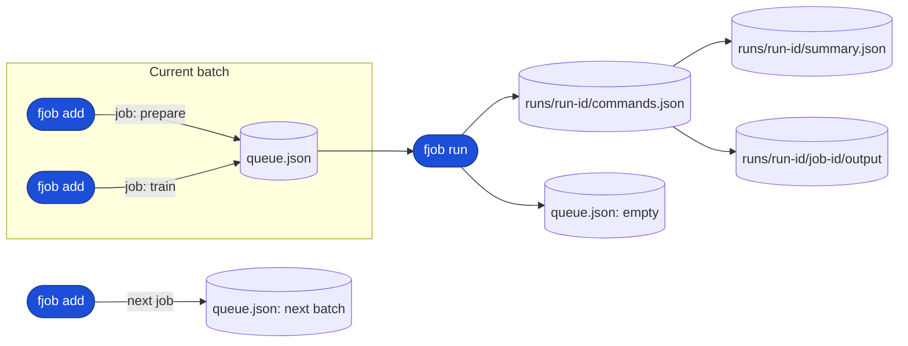
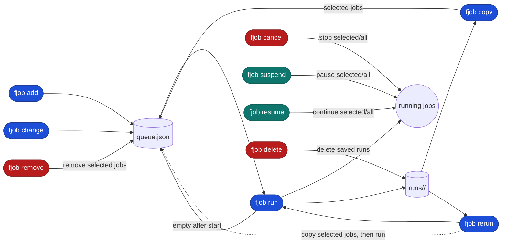

# fjob: File-based, flexible job runner for local and batch workloads

[](https://github.com/kamo-naoyuki/fjob/actions/workflows/ci.yml)

fjob is for the iterative loop behind computational experiments: queue many
jobs, keep each run's commands and output, inspect failures, change only what
needs fixing, and run it again without losing the previous history.

It is useful when a researcher is sweeping parameters, running a mixture of
local and scheduler-backed jobs (Slurm, PBS, or LSF), or debugging a batch repeatedly. Instead of turning a
terminal into a pile of background processes, each run stays named, inspectable,
and recoverable.

| Plain shell (background jobs) | fjob |
| --- | --- |
|  |  |

## Build and installation

```sh
go build -o fjob ./cmd/fjob
```

Check the version:

```sh
fjob version
fjob --version
```

Prebuilt binaries for Linux and macOS are available from the GitHub Releases
page. Go is only required when building from source or using `go install`.

Download the latest binary for your platform, make it executable, and put it
somewhere on your `PATH`:

```sh
os=$(uname -s | tr '[:upper:]' '[:lower:]')
arch=$(uname -m | sed 's/x86_64/amd64/; s/aarch64/arm64/')
curl -fL "https://github.com/kamo-naoyuki/fjob/releases/latest/download/fjob-${os}-${arch}" \
  -o /tmp/fjob
install -m 755 /tmp/fjob ~/.local/bin/fjob
```

Available binaries are `fjob-linux-amd64`, `fjob-linux-arm64`,
`fjob-darwin-amd64`, and `fjob-darwin-arm64`. The latest release is also
available from the [GitHub Releases](https://github.com/kamo-naoyuki/fjob/releases)
page.

With Go installed, you can install directly instead:

```sh
go install github.com/kamo-naoyuki/fjob/cmd/fjob@latest
```

### Shell completion

Completion scripts are available for Bash and Zsh:

```sh
# Install for the default shell reported by $SHELL
fjob completion install

# Select the shell explicitly when running a nested shell
fjob completion install bash
fjob completion install zsh
```

The completion is generated from the CLI metadata used by the program, and
covers subcommands, command options, executor values, run selection values, and
the `server` subcommands. `completion install` updates the shell configuration
idempotently; it does not duplicate an existing fjob completion block. Start a
new shell after installation, or source the shell configuration to apply it to
the current shell.

For manual setup, `fjob completion bash` and `fjob completion zsh` print the
raw completion scripts.

## Quick start

```sh
fjob check --queue-name build
fjob add --queue-name build --job-name build make
fjob add --queue-name build --name unit-tests go test ./...
fjob run --queue-name build --run-name unit-build
```

`add` adds a command. `run` executes the queued commands and waits for
completion. The queue name can be supplied with `--queue-name`,
`FJOB_QUEUE_NAME`, or omitted. When omitted, if only one queue exists in the state directory, it will be automatically selected; if multiple queues exist, you will be prompted to specify one.
Use `--job-name NAME` (or its `--name NAME` alias) to label a submitted job.
Use `--run-name NAME` to label a run; the generated run ID remains available for
unambiguous paths and commands.
Use `--depends-on NAME` to make a job wait for a named prerequisite. Repeat the
option to specify multiple prerequisites:

```sh
fjob add --job-name prepare ./prepare.sh
fjob add --job-name train --depends-on prepare ./train.sh
fjob run
```

Jobs without dependencies run in parallel. Dependencies must refer to named
jobs in the same queue; unknown jobs and dependency cycles are rejected before
the run starts. If a prerequisite fails, dependent jobs are recorded as
`blocked` and are not executed. Retries rerun only failed jobs, not jobs that
already succeeded. `fjob rerun --failed` likewise reruns failed job bodies
without rerunning successful prerequisites.

The typical debug loop is deliberately short:

```sh
fjob show --queue-name build --failed-logs
fjob change --queue-name build --job-name train -- ./train-v2.sh
fjob rerun --queue-name build --failed
```

The failed output remains attached to the old run, while the changed job is
run as a new attempt. This makes it practical to keep debugging until the
experiment is complete without rerunning work that already succeeded.

Copy jobs from a previous run into the current queue without executing them:

```sh
fjob copy --queue-name build --run-id RUN_ID --failed
fjob change --queue-name build --job-name unit-tests -- go test ./...
fjob run --queue-name build --retry 2
```

`copy` creates new job IDs and keeps dependencies between copied jobs. If the
queue is non-empty, the CLI asks for confirmation before replacing it; use
`--append` to add copied jobs or `--overwrite` to replace it without asking.
Selection options include `--failed`, `--unfinished`,
`--success`, `--nonsuccess`, and repeated `--job-id`.
Copied jobs remain pending in the new queue. Their source run, source job,
source status, and original working directory are retained as metadata so the
original output can be inspected without copying it.

`rerun` is the shorthand for copying selected jobs from the latest run into
the queue and then running that new queue. For example:

```sh
fjob copy --queue-name build --run-id RUN_ID --failed
fjob run --queue-name build
```

is equivalent to:

```sh
fjob rerun --queue-name build --failed
```

The selection options and queue overwrite confirmation used by `rerun` follow
the same rules as `copy`.

## Local web UI

Start the local web status UI separately from the job runner:

```sh
fjob web
```

Open `http://127.0.0.1:8787` in a browser. By default, the web server shows all
queues in the state directory; use `--queue-name build` to filter to one queue.
It reads job state from the state directory and shows the working directory
and terminal command needed to copy jobs for another run. It can also copy all
or failed jobs into a queue after confirmation; it does not start or control
the runner.
Stopping the web server does not stop the runner or any jobs.

## Example

Build and run the included example:

```sh
go build -o fjob ./cmd/fjob
./example.sh demo
```

The example includes local and Slurm jobs in one queue. Set
`FJOB_ASYNC=true` to use async mode.

## Queue, runs, and state

`add` assembles the next experiment in `queue.json`. `run` freezes that
batch into one run ID and stores its snapshot, logs, and results separately.



The state directory mirrors this lifecycle:

```text
<basedir>/
└── queues/
  └── <queue-name>/
    ├── queue.json
    └── runs/
      └── <run-id>/
        ├── commands.json
        ├── summary.json
        └── <job-id>/
          ├── command.json
          └── output
```

Each submitted command has a stable job ID. `run` saves the complete command
snapshot under `runs/<run-id>/`, together with a summary and each job's log.
After it finishes, the queue is emptied, while the run can be inspected or used
with selections such as `fjob rerun --failed`. The next `add` starts a new batch while
keeping the previous run history. Use `delete` to remove saved run logs
explicitly. Use `run --async` when an experiment should continue after the
terminal returns.

## Environment variables

| Variable | Purpose |
| --- | --- |
| `FJOB_BASEDIR` | Base directory for queue state. Overridden by `--basedir`. |
| `FJOB_QUEUE_NAME` | Default queue name. Overridden by `--queue-name`. |
| `FJOB_MASTERDIR` | Directory used by `fjob server list` to find supervisors. |
| `XDG_STATE_HOME` | Base location used when `FJOB_BASEDIR` or `FJOB_MASTERDIR` is not set. |

The resolution order for the state directory is:
1. `--basedir` option
2. `FJOB_BASEDIR` environment variable
3. `./.fjob-state` (if it exists in the current directory)
4. Default location (`$XDG_STATE_HOME/fjob` or `~/.local/state/fjob`)

The resolution logic for the queue name when `--queue-name` is omitted is:
1. `--queue-name` option
2. `FJOB_QUEUE_NAME` environment variable
3. Automatically select if exactly one queue exists in the state directory
4. Default queue name (`default`) if no queues exist yet (if multiple queues exist, an error will prompt you to specify one)

The included `example.sh` also supports:

| Variable | Purpose |
| --- | --- |
| `FJOB_SLURM_OPTIONS` | Common Slurm options used by the example, such as `-p short`. |
| `FJOB_ASYNC` | Set to `true` to run the example asynchronously; defaults to `false`. |

## Slurm

Executor and Slurm options can be set per command:

```sh
fjob add --queue-name build make
fjob add --queue-name build \
  --executor slurm \
  --executor-option="-p short --cpus-per-task=2" \
  ./heavy-test.sh
fjob run --queue-name build --local-concurrency 4 --batch-concurrency 8 --retry 2
```

Local and scheduler-backed commands may be mixed in the same queue. Use
`--local-concurrency` for local jobs and `--batch-concurrency` for Slurm jobs.
Use `--retry N` to retry failed jobs up to N additional times.
Use `--retry -1` to retry failed jobs indefinitely.

## Async runs

```sh
fjob run --queue-name build --async
fjob wait --queue-name build
```

The async start message prints commands for checking status and cancelling the
run. `wait` returns the overall run exit code.

An async run is started as a detached process in a new session (`setsid`), so
it keeps running even if the terminal that launched it is closed. Use
`fjob wait` from any terminal (or later) to block on the run, and
`fjob cancel` to stop it.

## Inspect and recover

To inspect the latest run or list all runs:

```sh
fjob show --queue-name build
fjob show --queue-name build --runs
fjob show --queue-name build --failed
fjob show --queue-name build --job-id JOB_ID
fjob show --queue-name build --logs
fjob show --queue-name build --failed-logs
```

`--logs` prints the output log for every job in the selected run.
`--failed-logs` prints logs only for jobs that failed. Both options accept
`--run-id RUN_ID` to inspect a specific run.
Without `--run-id`, `show` displays the current queue when it has commands;
otherwise it displays the latest run. Use `--run-id` to inspect a run while a
changed or newly submitted queue is waiting.
When output is a terminal, log views (including `--job-id`) longer than 24
lines open in `$PAGER` (or `less -R` by default). Use `--no-pager` to print
directly; piped and redirected output is always printed directly.

Run selected jobs from the latest run:

```sh
fjob rerun --queue-name build --failed
fjob rerun --queue-name build --unfinished
fjob rerun --queue-name build --success
fjob rerun --queue-name build --nonsuccess
fjob rerun --queue-name build --job-id JOB_ID
```

`--job-id` may be repeated to rerun selected jobs. It is mutually exclusive
with the result filters above.

Prepare a modified batch from the latest run without changing its history:

```sh
fjob change --job-name train --executor local
fjob change --job-name train --executor-option="-p gpu"
fjob change --job-name train --depends-on prepare -- ./train-v2.sh
fjob rerun --failed
```

`change` requires exactly one target selector: `--job-id ID` or
`--job-name NAME`. It also requires at least one change, such as a new command,
`--executor`, `--executor-option`, `--set-job-name`, or `--depends-on`.
It replaces only the options specified, keeps the job ID, and edits the current
batch. If the queue is empty, the latest run snapshot is restored first. Use
`--run-id` to select another run.

Remove jobs from the current batch without affecting saved run history:

```sh
fjob remove --queue-name build --job-name train
fjob remove --queue-name build --job-id JOB_ID --job-id OTHER_JOB_ID
```

If the queue is empty, `remove` restores the latest run snapshot first. Use
`--run-id` to select another run. Specify exactly one target selector:
`--job-name NAME` or one or more `--job-id ID` options. Removing a job that
another queued job depends on is rejected.

Stop running jobs without stopping the supervisor:

```sh
fjob cancel --queue-name build
fjob cancel --queue-name build --job-id JOB_ID
```

`--job-id` is optional. Without it, all running jobs in the queue are
cancelled. With it, only the specified running jobs are cancelled, and the
option may be repeated. `--job-id` cannot be used with `--wait`.

Temporarily suspend and resume running jobs:

```sh
fjob suspend --queue-name build
fjob suspend --queue-name build --job-id JOB_ID
fjob resume --queue-name build --job-id JOB_ID
```

Without `--job-id`, all currently running jobs are affected. Repeat `--job-id`
to control selected jobs. Local jobs use `SIGSTOP`/`SIGCONT`; Slurm jobs use
`scontrol suspend`/`scontrol resume`.

Delete saved run logs while keeping queued commands:

```sh
fjob delete --queue-name build
fjob delete --queue-name build --run-id RUN_ID
```

`--run-id` removes only the specified run. Without it, all saved run logs are removed.
The old name `clear` is still accepted as an alias for `delete`.

The commands affect the current batch and saved run history differently:



## Server management

The supervisor starts automatically when a run needs it and stops after the
run finishes. These commands are mainly useful for inspection and cleanup:

```sh
fjob server status
fjob server list
fjob server shutdown
```
