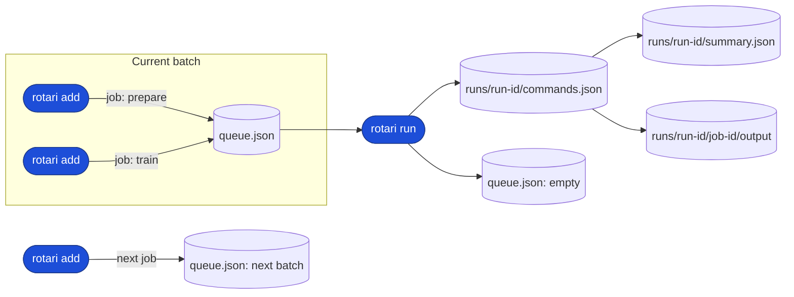
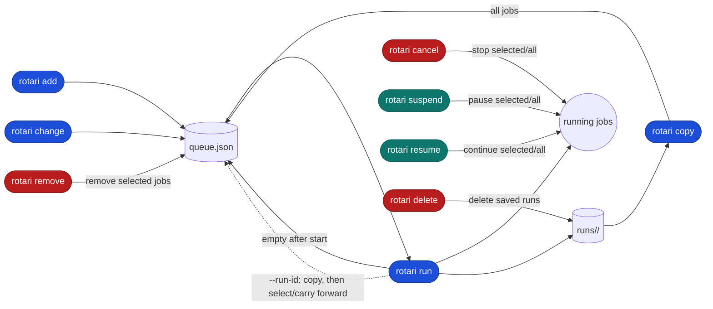

# rotari: File-based, flexible job runner for local and batch workloads

[](https://github.com/kamo-naoyuki/rotari/actions/workflows/ci.yml) [](https://kamo-naoyuki.github.io/rotari/)

rotari is for the iterative loop behind computational experiments: queue many
jobs, keep each run's commands and output, inspect failures, change only what
needs fixing, and run it again without losing the previous history.

It is useful when a researcher is sweeping parameters, running a mixture of
local and scheduler-backed jobs (Slurm, PBS, or LSF), or debugging a batch repeatedly. Instead of turning a
terminal into a pile of background processes, each run stays named, inspectable,
and recoverable.

| Plain shell (background jobs) | rotari |
| --- | --- |
|  |  |

## Build and installation

```sh
go build -o rotari ./cmd/rotari
```

Check the version:

```sh
rotari version
rotari --version
```

Prebuilt binaries for Linux and macOS are available from the GitHub Releases
page. Go is only required when building from source or using `go install`.

Download the latest binary for your platform, make it executable, and put it
somewhere on your `PATH`:

```sh
os=$(uname -s | tr '[:upper:]' '[:lower:]')
arch=$(uname -m | sed 's/x86_64/amd64/; s/aarch64/arm64/')
curl -fL "https://github.com/kamo-naoyuki/rotari/releases/latest/download/rotari-${os}-${arch}" \
  -o /tmp/rotari
install -m 755 /tmp/rotari ~/.local/bin/rotari
```

Available binaries are `rotari-linux-amd64`, `rotari-linux-arm64`,
`rotari-darwin-amd64`, and `rotari-darwin-arm64`. The latest release is also
available from the [GitHub Releases](https://github.com/kamo-naoyuki/rotari/releases)
page.

With Go installed, you can install directly instead:

```sh
go install github.com/kamo-naoyuki/rotari/cmd/rotari@latest
```

### Shell completion

Completion scripts are available for Bash and Zsh:

```sh
# Install for the default shell reported by $SHELL
rotari completion install

# Select the shell explicitly when running a nested shell
rotari completion install bash
rotari completion install zsh
```

The completion is generated from the CLI metadata used by the program, and
covers subcommands, command options, executor values, run selection values, and
the `server` subcommands. `completion install` updates the shell configuration
idempotently; it does not duplicate an existing rotari completion block. Start a
new shell after installation, or source the shell configuration to apply it to
the current shell.

For manual setup, `rotari completion bash` and `rotari completion zsh` print the
raw completion scripts.

## Quick start

```sh
rotari check --queue-name build
rotari add --queue-name build --job-name build make
rotari add --queue-name build --name unit-tests go test ./...
rotari run --queue-name build --run-name unit-build
```

`add` adds a command. `run` executes the queued commands and waits for
completion. The queue name can be supplied with `--queue-name`,
`ROTARI_QUEUE_NAME`, or omitted. When omitted, if only one queue exists in the state directory, it will be automatically selected; if multiple queues exist, you will be prompted to specify one.
Use `--job-name NAME` (or its `--name NAME` alias) to label a submitted job.
Use `--run-name NAME` to label a run; the generated run ID remains available for
unambiguous paths and commands.
Use `--depends-on NAME` to make a job wait for a named prerequisite. Repeat the
option to specify multiple prerequisites:

```sh
rotari add --job-name prepare ./prepare.sh
rotari add --job-name train --depends-on prepare ./train.sh
rotari run
```

Jobs without dependencies run in parallel. Dependencies must refer to named
jobs in the same queue; unknown jobs and dependency cycles are rejected before
the run starts. If a prerequisite fails, dependent jobs are recorded as
`blocked` and are not executed. Retries rerun only failed jobs, not jobs that
already succeeded. `rotari retry` likewise reruns failed and
unfinished job bodies
without rerunning successful prerequisites.

The typical debug loop is deliberately short:

```sh
rotari show --queue-name build --failed-logs
rotari change --queue-name build --job-name train -- ./train-v2.sh
rotari retry --queue-name build
```

Jobs that already succeeded are not re-executed; they are carried forward into
the new run with their previous result and a link back to the original output,
so the whole run (old successes and freshly retried jobs) shows up together on
one run page. This makes it practical to keep debugging until the experiment
is complete without rerunning work that already succeeded.

Copy jobs from a previous run into the current queue without executing them:

```sh
rotari copy --queue-name build --run-id RUN_ID --failed --unfinished
rotari change --queue-name build --job-name unit-tests -- go test ./...
rotari run --queue-name build --retry 2
```

`copy` creates new job IDs only if they would collide with jobs already in the
destination queue; otherwise the source job ID is kept, and dependencies
between copied jobs are preserved. If the queue is non-empty, the CLI asks for
confirmation before replacing it; use `--append` to add copied jobs or
`--overwrite` to replace it without asking. Selection options include
`--failed`, `--unfinished`, `--success`, and repeated `--job-id`.
Copied jobs remain pending in the new queue. Their source run, source job,
source status, and original working directory are retained as metadata so the
original output can be inspected without copying it.

`run` (and its aliases `retry` and, with explicit filters, `run --failed`
etc.) can also select jobs directly from a run instead of the live queue.
`--run-id ID` repopulates the queue from that run first, equivalent to
`copy --run-id ID --overwrite` followed by `run`; result filters
(`--failed`/`--unfinished`/`--success`/`--job-id`) then decide which of those
jobs are actually re-executed. Jobs that don't match the filter but already
finished in the reference run (the given `--run-id`, or the latest run when
`--run-id` is omitted) are carried forward instead of re-executed. For
example:

```sh
rotari run --queue-name build --run-id RUN_ID --failed
```

is equivalent to:

```sh
rotari copy --queue-name build --run-id RUN_ID --overwrite
rotari run --queue-name build --failed
```

## Local web UI

See the [web demo](https://kamo-naoyuki.github.io/rotari/) for a read-only UI
using generated example data.

Start the local web status UI separately from the job runner:

```sh
rotari web
```

Open `http://127.0.0.1:8787` in a browser. By default, the web server shows all
queues in the state directory; use `--queue-name build` to filter to one queue.
It reads job state from the state directory and shows the working directory
and terminal command needed to copy jobs for another run. It can also copy all
or failed jobs into a queue after confirmation; it does not start or control
the runner.
Stopping the web server does not stop the runner or any jobs.

## Example

Build and run the included example:

```sh
go build -o rotari ./cmd/rotari
./example.sh demo
```

The example includes local and Slurm jobs in one queue. Set
`ROTARI_ASYNC=true` to use async mode.

## Queue, runs, and state

`add` assembles the next experiment in `queue.json`. `run` freezes that
batch into one run ID and stores its snapshot, logs, and results separately.



The state directory mirrors this lifecycle:

```text
<basedir>/
└── queues/
  └── <queue-name>/
    ├── queue.json
    └── runs/
      └── <run-id>/
        ├── commands.json
        ├── summary.json
        └── <job-id>/
          ├── command.json
          └── output
```

Each submitted command has a stable job ID. `run` saves the complete command
snapshot under `runs/<run-id>/`, together with a summary and each job's log.
After it finishes, the queue is emptied, while the run can be inspected or used
with selections such as `rotari retry`. The next `add` starts a new batch while
keeping the previous run history. Use `delete` to remove saved run logs
explicitly. Use `run --async` when an experiment should continue after the
terminal returns.

## Environment variables

| Variable | Purpose |
| --- | --- |
| `ROTARI_BASEDIR` | Base directory for queue state. Overridden by `--basedir`. |
| `ROTARI_QUEUE_NAME` | Default queue name. Overridden by `--queue-name`. |
| `ROTARI_MASTERDIR` | Directory used by `rotari server list` to find supervisors. |
| `XDG_STATE_HOME` | Base location used when `ROTARI_BASEDIR` or `ROTARI_MASTERDIR` is not set. |

The resolution order for the state directory is:
1. `--basedir` option
2. `ROTARI_BASEDIR` environment variable
3. `./.rotari-state` (if it exists in the current directory)
4. Default location (`$XDG_STATE_HOME/rotari` or `~/.local/state/rotari`)

The resolution logic for the queue name when `--queue-name` is omitted is:
1. `--queue-name` option
2. `ROTARI_QUEUE_NAME` environment variable
3. Automatically select if exactly one queue exists in the state directory
4. Default queue name (`default`) if no queues exist yet (if multiple queues exist, an error will prompt you to specify one)

The included `example.sh` also supports:

| Variable | Purpose |
| --- | --- |
| `ROTARI_SLURM_OPTIONS` | Common Slurm options used by the example, such as `-p short`. |
| `ROTARI_ASYNC` | Set to `true` to run the example asynchronously; defaults to `false`. |

## Slurm

Executor and Slurm options can be set per command:

```sh
rotari add --queue-name build make
rotari add --queue-name build \
  --executor slurm \
  --executor-option="-p short --cpus-per-task=2" \
  ./heavy-test.sh
rotari run --queue-name build --local-concurrency 4 --batch-concurrency 8 --retry 2
```

Local and scheduler-backed commands may be mixed in the same queue. Use
`--local-concurrency` for local jobs and `--batch-concurrency` for Slurm jobs.
Use `--retry N` to retry failed jobs up to N additional times.
Use `--retry -1` to retry failed jobs indefinitely.

## Async runs

```sh
rotari run --queue-name build --async
rotari wait --queue-name build
```

The async start message prints commands for checking status and cancelling the
run. `wait` returns the overall run exit code.

An async run is started as a detached process in a new session (`setsid`), so
it keeps running even if the terminal that launched it is closed. Use
`rotari wait` from any terminal (or later) to block on the run, and
`rotari cancel` to stop it.

## Inspect and recover

To inspect the latest run or list all runs:

```sh
rotari show --queue-name build
rotari show --queue-name build --runs
rotari show --queue-name build --failed
rotari show --queue-name build --job-id JOB_ID
rotari show --queue-name build --logs
rotari show --queue-name build --failed-logs
```

`--logs` prints the output log for every job in the selected run.
`--failed-logs` prints logs only for jobs that failed. Both options accept
`--run-id RUN_ID` to inspect a specific run.
Without `--run-id`, `show` displays the current queue when it has commands;
otherwise it displays the latest run. Use `--run-id` to inspect a run while a
changed or newly submitted queue is waiting.
When output is a terminal, log views (including `--job-id`) longer than 24
lines open in `$PAGER` (or `less -R` by default). Use `--no-pager` to print
directly; piped and redirected output is always printed directly.

Run selected jobs from the latest run, carrying forward everything else:

```sh
rotari run --queue-name build --failed
rotari run --queue-name build --unfinished
rotari run --queue-name build --success
rotari run --queue-name build --failed --unfinished
rotari run --queue-name build --job-id JOB_ID
rotari retry --queue-name build
```

The result filters select which jobs are actually re-executed:

| Option | Executed jobs |
| --- | --- |
| `--failed` | Finished jobs with a non-zero exit code. |
| `--unfinished` | Jobs without a completed result. |
| `--success` | Finished jobs with exit code zero. |
| `--failed --unfinished` | Failed or unfinished jobs. |

Result filters and job IDs may be combined; jobs matching any selected filter
or ID are executed. Jobs that do not match but already have a finished result
in the reference run (the latest run, or the run given by `--run-id`) are
carried forward: they are not re-executed, and their previous result and
output remain visible on the new run's page. Jobs that neither match nor have
a previous result are simply left unfinished.
For example, `--failed --unfinished` re-executes failed or unfinished jobs
while carrying forward everything that already succeeded; `rotari retry` is
shorthand for `rotari run --failed --unfinished`.

Use `--failed --unfinished` when a run may have been interrupted and you want to
recover everything that did not complete successfully. `--job-id` selects
specific jobs by ID instead of filtering by result.

`--job-id` may be repeated to select jobs to execute. It is mutually exclusive
with the result filters above. `--run-id ID` changes the reference run used
for both the queue snapshot and the result filters; see the earlier section
for details.

Prepare a modified batch from the latest run without changing its history:

```sh
rotari change --job-name train --executor local
rotari change --job-name train --executor-option="-p gpu"
rotari change --job-name train --depends-on prepare -- ./train-v2.sh
rotari retry
```

`change` requires exactly one target selector: `--job-id ID` or
`--job-name NAME`. It also requires at least one change, such as a new command,
`--executor`, `--executor-option`, `--set-job-name`, or `--depends-on`.
It replaces only the options specified, keeps the job ID, and edits the current
batch. If the queue is empty, the latest run snapshot is restored first. Use
`--run-id` to select another run.

Remove jobs from the current batch without affecting saved run history:

```sh
rotari remove --queue-name build --job-name train
rotari remove --queue-name build --job-id JOB_ID --job-id OTHER_JOB_ID
```

If the queue is empty, `remove` restores the latest run snapshot first. Use
`--run-id` to select another run. Specify exactly one target selector:
`--job-name NAME` or one or more `--job-id ID` options. Removing a job that
another queued job depends on is rejected.

Stop running jobs without stopping the supervisor:

```sh
rotari cancel --queue-name build
rotari cancel --queue-name build --job-id JOB_ID
```

`--job-id` is optional. Without it, all running jobs in the queue are
cancelled. With it, only the specified running jobs are cancelled, and the
option may be repeated. `--job-id` cannot be used with `--wait`.

Temporarily suspend and resume running jobs:

```sh
rotari suspend --queue-name build
rotari suspend --queue-name build --job-id JOB_ID
rotari resume --queue-name build --job-id JOB_ID
```

Without `--job-id`, all currently running jobs are affected. Repeat `--job-id`
to control selected jobs. Local jobs use `SIGSTOP`/`SIGCONT`; Slurm jobs use
`scontrol suspend`/`scontrol resume`.

Delete saved run logs while keeping queued commands:

```sh
rotari delete --queue-name build
rotari delete --queue-name build --run-id RUN_ID
```

`--run-id` removes only the specified run. Without it, all saved run logs are removed.
The old name `clear` is still accepted as an alias for `delete`.

The commands affect the current batch and saved run history differently:



## Server management

The supervisor starts automatically when a run needs it and stops after the
run finishes. These commands are mainly useful for inspection and cleanup:

```sh
rotari server status
rotari server list
rotari server shutdown
```
